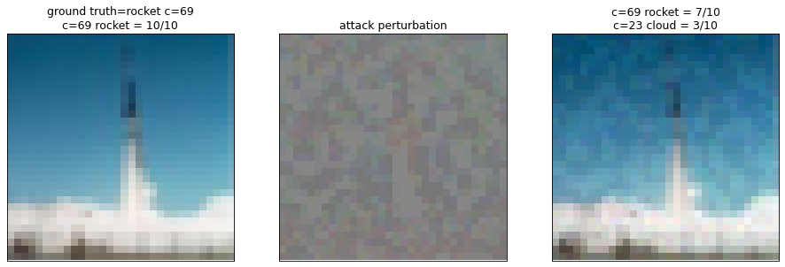
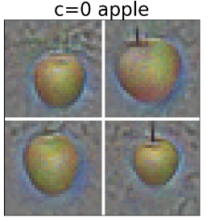
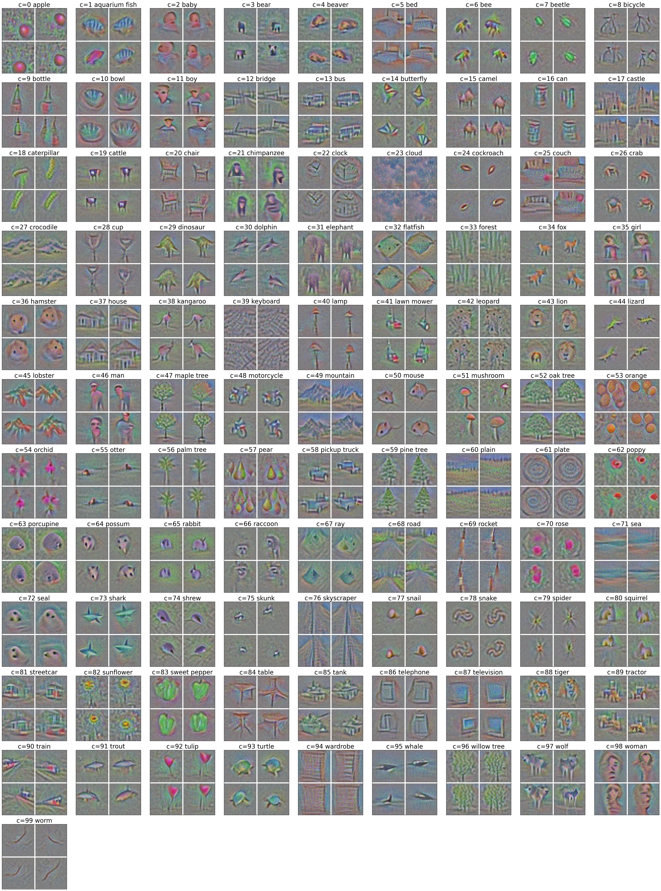

# Ensemble everything everywhere: Multi-scale aggregation for adversarial robustness

This repository contains the code to replicate the key results from the paper [Ensemble everything everywhere: Multi-scale aggregation for adversarial robustness](https://arxiv.org/abs/2408.05446). I also have an [explanation website for it](https://stanislavfort.com/ensemble-everything/) and a [thread on Twitter/X](https://x.com/stanislavfort/status/1823347721358438624). The results here are the **lower bound** on the performance of the multi-resolution self-ensemble. On an A100, the Colab runs for 20 min for the backbone training (6 epochs) but more epochs and especially lower learning rate training later helps. The linear probes used in the self-ensemble are trained only for a single epoch each as well.

## Training a multi-resolution self-ensemble in a Colab to ~SOTA adversarial accuracy
[Our first Colab](https://github.com/stanislavfort/ensemble-everything-everywhere/blob/main/quick_replication_for_multi_resolution_self_ensemble.ipynb) does the following in end-to-end way:
1. It trains a **multi-resolution** backbone model on CIFAR-100 from an ImageNet pretrained ResNet152.
2. It adds linear heads on intermediate layers and forms a **multi-resolution self-ensemble**
3. It runs the [RobustBench AutoAttack](https://robustbench.github.io/) adversarial attack suite with the `rand` flag on (making it harder for our model) on CIFAR-100 with $L_\infty = 8/255$ on the first 32 images of the CIFAR-100 test set
4. The result is an **adversarial accuracy of >60%**, which is above state-of-the-art already (SOTA is 42.67% and that is with *tons* of adversarial training)  (the first images on CIFAR-100 test set are unusually hard for the attack to break, the accuracy drops on later images, as shown in the paper)

These results are not well optimized. Longer training and better hyperparamters will reliably result in even higher adversarial accuracy. We chose the set up as is in the Colab to demonstrate what can be done in well under an hour of training in on a single A100.

We also run a set of visualizations on the trained multi-resolution self-ensemble:

5. We visualize the successful attacks of the AutoAttack adversarial attack suite on our model. An example where a *rocket* is turned into a *cloud* (to some extent) is shown here:


6. We also show 4 examples from each of the 100 CIFAR-100 classes of optimizing from grey pixels towards the target label directly. This would normally result in noisy images. In case of the model you train in the Colab, the results are convincing and definitely very interpterable images of the target class semantic content.

The apple class (c=0) looks like this:



For the 100 classes of CIFAR-100, the results looks like this:



If you want to cite us, please use the folling BibTeX:
```
@misc{fort2024ensemble,
    title={Ensemble everything everywhere: Multi-scale aggregation for adversarial robustness},
    author={Stanislav Fort and Balaji Lakshminarayanan},
    year={2024},
    eprint={2408.05446},
    archivePrefix={arXiv},
    primaryClass={cs.CV}
}
```
